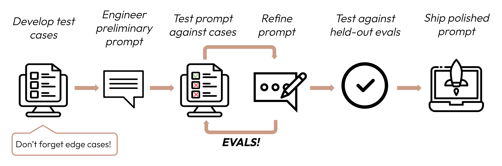

> Source: https://platform.claude.com/docs/en/test-and-evaluate/develop-tests

# Define success criteria and build evaluations

Building a successful LLM-based application starts with clearly defining your success criteria and then designing evaluations to measure performance against them. This cycle is central to prompt engineering.

## Define your success criteria

Good success criteria are:

- **Specific:** Clearly define what you want to achieve. Instead of "good performance," specify "accurate sentiment classification."

- **Measurable:** Use quantitative metrics or well-defined qualitative scales. Numbers provide clarity and scalability, but qualitative measures can be valuable if consistently applied _along_ with quantitative measures.

  - Even "hazy" topics such as ethics and safety can be quantified:

    |     | Safety criteria |
    | --- | --- |
    | Bad | Safe outputs |
    | Good | Less than 0.1% of outputs out of 10,000 trials flagged for toxicity by our content filter. |

- **Achievable:** Base your targets on industry benchmarks, prior experiments, AI research, or expert knowledge. Your success metrics should not be unrealistic to current frontier model capabilities.

- **Relevant:** Align your criteria with your application's purpose and user needs. Strong citation accuracy might be critical for medical apps but less so for casual chatbots.

### Common success criteria

Categories that might be important for your use case (non-exhaustive):

- **Task fidelity** — Does the output do what was asked?
- **Consistency** — Are outputs stable across similar inputs?
- **Relevance and coherence** — Is the output on-topic and logically structured?
- **Tone and style** — Does the output match the desired voice?
- **Privacy preservation** — Does the output avoid exposing sensitive data?
- **Context utilization** — Does the output leverage available context well?
- **Latency** — Is the response fast enough for the use case?
- **Price** — Is the cost per call acceptable?

Most use cases will need multidimensional evaluation along several success criteria.

---

## Build evaluations

### Eval design principles

1. **Be task-specific:** Design evals that mirror your real-world task distribution. Don't forget to factor in edge cases!
2. **Automate when possible:** Structure questions to allow for automated grading (e.g., multiple-choice, string match, code-graded, LLM-graded).
3. **Prioritize volume over quality:** More questions with slightly lower signal automated grading is better than fewer questions with high-quality human hand-graded evals.

### Example eval types

- **Task fidelity (sentiment analysis)** — exact match evaluation
- **Consistency (FAQ bot)** — cosine similarity evaluation
- **Relevance and coherence (summarization)** — ROUGE-L evaluation
- **Tone and style (customer service)** — LLM-based Likert scale
- **Privacy preservation (medical chatbot)** — LLM-based binary classification
- **Context utilization (conversation assistant)** — LLM-based ordinal scale

> Writing hundreds of test cases can be hard to do by hand! Get Claude to help you generate more from a baseline set of example test cases.

---

## Grade your evaluations

Choose the fastest, most reliable, most scalable method:

1. **Code-based grading:** Fastest and most reliable, extremely scalable, but lacks nuance for complex judgements.
   - Exact match: `output == golden_answer`
   - String match: `key_phrase in output`

2. **Human grading:** Most flexible and high quality, but slow and expensive. Avoid if possible.

3. **LLM-based grading:** Fast and flexible, scalable and suitable for complex judgement. Test to ensure reliability first then scale.

### Tips for LLM-based grading

- **Have detailed, clear rubrics:** "The answer should always mention 'Acme Inc.' in the first sentence. If it does not, the answer is automatically graded as 'incorrect.'"
  - A given use case, or even a specific success criteria, might require several rubrics for holistic evaluation.
- **Empirical or specific:** Instruct the LLM to output only 'correct' or 'incorrect', or to judge from a scale of 1-5. Purely qualitative evaluations are hard to assess quickly and at scale.
- **Encourage reasoning:** Ask the LLM to think first before deciding an evaluation score, then discard the reasoning. This increases evaluation performance, particularly for tasks requiring complex judgement.
